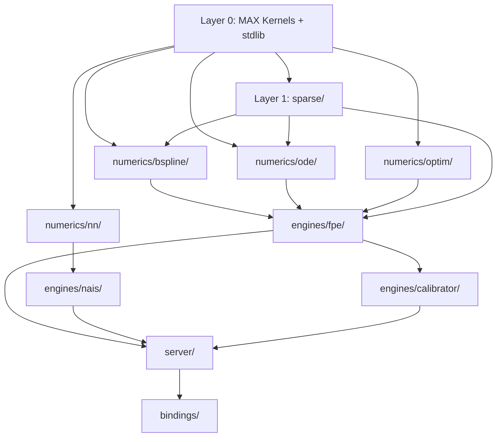

# FPE Option Pricing Engine — Detailed Coding Plan

> **Goal**: Production-level Mojo project — every file, struct, function, test, and benchmark specified  
> **Based on**: `IMPLEMENTATION_PLAN.md` v3 (unified parametric design)  
> **Total files**: ~36 source + ~10 test + ~6 benchmark + examples + bindings

---

## Phase 1: Foundation (Weeks 1–3)

### 1.1 Project Bootstrap (Week 1, Days 1–2)

**Files to create:**

| File | Action |
|---|---|
| `pixi.toml` | Mojo v0.26.2+, MAX SDK dependency |
| `mojoproject.toml` | Package name `fpe_option`, edition, src path |
| `src/__init__.mojo` | Top-level package |

**Tasks:**
1. Initialize `pixi` project with Mojo + MAX SDK channels
2. Configure `mojoproject.toml` with `src/` as source root
3. Write a smoke test: `mojo build` succeeds, `mojo run` prints version
4. Write MAX Kernels integration test — verify imports:
   ```
   from kernels.linalg.matmul import matmul
   from kernels.linalg.gemv import gemv
   from kernels.nn import rfft, irfft
   from layout import Layout, LayoutTensor
   ```
5. Verify GPU detection: `has_accelerator()` compiles on target hardware

**Exit Criteria:** `mojo build` and `mojo test` pass; MAX Kernels imports verified.

---

### 1.2 Layer 1 — Sparse Math Core (Week 1–3)

#### File: `src/sparse/__init__.mojo`
- Re-export all sparse types and operations

#### File: `src/sparse/csr.mojo` — CSRMatrix

**Struct: `CSRMatrix[dtype: DType]`**

| Field | Type | Description |
|---|---|---|
| `data` | `List[Scalar[dtype]]` | Non-zero values |
| `indices` | `List[Int]` | Column indices per non-zero |
| `indptr` | `List[Int]` | Row pointers (len = nrows+1) |
| `nrows` | `Int` | Row count |
| `ncols` | `Int` | Column count |
| `nnz` | `Int` | Non-zero count |

**Methods to implement:**

| Method | Signature | Details |
|---|---|---|
| `__init__` | `(data, indices, indptr, nrows, ncols)` | Validate lengths, set `nnz = len(data)` |
| `from_dense` | `@staticmethod (dense: List[...]) -> Self` | Scan rows, extract non-zeros |
| `to_dense` | `() -> List[List[Scalar[dtype]]]` | Expand for debugging/testing |
| `spmv` | `(x: Span[Scalar[dtype]]) -> List[Scalar[dtype]]` | Row-wise dot product, `vectorize[]` inner loop |
| `spmv_into` | `(x: Span[...], mut y: Span[...])` | In-place version for ODE RHS |
| `get` | `(row, col) -> Scalar[dtype]` | Binary search in row |
| `transpose` | `() -> CSRMatrix[dtype]` | CSR → COO → transpose → CSR |
| `to_gpu` | `(ctx: DeviceContext) -> GPUCSRMatrix[dtype]` | Allocate DeviceBuffers, copy |
| `__str__` | Format for Writable trait | Sparse display |

**SIMD optimization for `spmv`:**
```
for row in range(nrows):
    var start = indptr[row]; var end = indptr[row+1]
    var acc = SIMD[dtype, simd_width](0)
    # vectorize inner loop over [start, end)
    # handle remainder with scalar loop
    y[row] = acc.reduce_add()
```

**Estimated lines:** ~200

---

#### File: `src/sparse/coo.mojo` — COOMatrix

**Struct: `COOMatrix[dtype: DType]`**

| Field | Type |
|---|---|
| `row` | `List[Int]` |
| `col` | `List[Int]` |
| `data` | `List[Scalar[dtype]]` |
| `nrows` | `Int` |
| `ncols` | `Int` |

**Methods:**

| Method | Details |
|---|---|
| `__init__` | Empty or from triplets |
| `add` | `(r, c, val)` — append triplet |
| `to_csr` | Sort by (row, col), compress — use `std.algorithm` sort |
| `from_dense` | `@staticmethod` scan |

**Estimated lines:** ~100

---

#### File: `src/sparse/diag.mojo` — DiagMatrix

**Struct: `DiagMatrix[dtype: DType]`**

| Method | Details |
|---|---|
| `__init__` | From `List[Scalar[dtype]]` diagonal |
| `matvec` | `y[i] = diag[i] * x[i]` — pure SIMD via `vectorize` |
| `to_csr` | Convert to CSR (n non-zeros on diagonal) |
| `inverse` | `diag_inv[i] = 1.0 / diag[i]` — for mass matrix lumping |

**Estimated lines:** ~60

---

#### File: `src/sparse/ops.mojo` — Sparse Operations

| Function | Signature | Algorithm |
|---|---|---|
| `kron` | `(A: CSRMatrix, B: CSRMatrix) -> CSRMatrix` | Kronecker: `(i*Bn+k, j*Bm+l) = A[i,j]*B[k,l]`. Pre-allocate `nnz_A * nnz_B`. |
| `spgemm` | `(A: CSRMatrix, B: CSRMatrix) -> CSRMatrix` | Row-by-row: for each row of A, accumulate scaled rows of B. Hash-map per row. |
| `spmm` | `(A: CSRMatrix, D: DenseMatrix) -> DenseMatrix` | Sparse × Dense: row-wise scatter-multiply. |
| `add` | `(A: CSRMatrix, B: CSRMatrix) -> CSRMatrix` | Merge sorted index lists per row. |
| `scale` | `(alpha: Scalar, A: CSRMatrix) -> CSRMatrix` | Scale all `data` values. |

**Estimated lines:** ~250

---

#### File: `src/sparse/gpu_kernels.mojo` — GPU Sparse Kernels

| Kernel | Grid | Details |
|---|---|---|
| `spmv_kernel` | `(nrows,)` | One thread per row, accumulate dot product |
| `batch_spmv_kernel` | `(nrows, B)` | `global_idx.x` = row, `global_idx.y` = batch |

Each kernel uses `LayoutTensor` for all buffer arguments.

**Estimated lines:** ~120

---

#### File: `tests/test_sparse.mojo`

| Test | Validates |
|---|---|
| `test_csr_from_dense_roundtrip` | `from_dense → to_dense` identity |
| `test_csr_spmv_small` | 3×3 known matrix |
| `test_csr_spmv_simd` | Larger matrix, compare vs dense matvec |
| `test_coo_to_csr` | Unsorted triplets → CSR matches expected |
| `test_kron_identity` | `kron(I₂, I₃)` == `I₆` |
| `test_kron_known` | Known 2×2 ⊗ 2×2 result |
| `test_spgemm_identity` | `A @ I = A` |
| `test_spgemm_known` | Small A × B vs dense result |
| `test_diag_matvec` | Diagonal scaling |
| `test_diag_inverse` | `D @ D_inv = I` |

**Reference data:** Generate with `scipy.sparse` in `tests/reference/generate_reference.py`.

---

#### File: `benchmarks/bench_sparse_ops.mojo`

| Benchmark | Setup |
|---|---|
| `bench_spmv_100` | 100×100 sparse, 10% fill |
| `bench_spmv_1000` | 1000×1000 sparse, 1% fill |
| `bench_kron_50x50` | kron of two 50×50 |
| `bench_spgemm_100` | 100×100 × 100×100 |

---

## Phase 2: B-Spline + ODE + Optimizer (Weeks 4–7)

### 2.1 B-Spline Module (Weeks 4–5)

#### File: `src/numerics/bspline/knots.mojo`

**Struct: `GenerateKnots`**

| Method | Details |
|---|---|
| `uniform` | `(a, b, n_interior, degree) -> List[Float64]` — clamped uniform |
| `chebyshev` | `(a, b, n_interior, degree) -> List[Float64]` — Chebyshev nodes |
| `from_data` | `(data_points, n_interior, degree) -> List[Float64]` — quantile-based |

**Estimated lines:** ~80

---

#### File: `src/numerics/bspline/basis.mojo`

**Struct: `BSplineBasis[degree: Int]`**

| Field | Type |
|---|---|
| `knots` | `List[Float64]` |
| `n_basis` | `Int` |

| Method | Details |
|---|---|
| `__init__` | From knot vector, compute `n_basis = len(knots) - degree - 1` |
| `evaluate` | `(x: Float64) -> List[Float64]` — De Boor-Cox with `comptime for` unrolled over degree |
| `evaluate_batch` | `(xs: Span[Float64]) -> List[List[Float64]]` — SIMD-vectorized batch eval |
| `evaluate_deriv` | `(x: Float64, order: Int) -> List[Float64]` — derivative of basis |
| `collocation_matrix` | `(xs: Span[Float64]) -> CSRMatrix[DType.float64]` — sparse N×n matrix |
| `greville_abscissae` | `() -> List[Float64]` — knot averages |

**Key optimization:** `comptime for d in range(degree):` unrolls the recursion at compile time. Inner evaluation uses `vectorize[]` for SIMD.

**Estimated lines:** ~250

---

#### File: `src/numerics/bspline/recombination.mojo`

**Struct: `RecombinationBasis`**

| Method | Details |
|---|---|
| `__init__` | `(basis: BSplineBasis, constraints: List[...])` |
| `compute_matrix` | Build sparse recombination matrix `R` such that new basis = `R @ old basis` |
| `apply` | `(coeffs: Span[Float64]) -> List[Float64]` — transform coefficients |

**Estimated lines:** ~150

---

#### File: `src/numerics/bspline/tensor_product.mojo`

**Struct: `TensorProductBasis`**

| Field | Type |
|---|---|
| `basis_s` | `BSplineBasis[degree_s]` — spot dimension |
| `basis_v` | `BSplineBasis[degree_v]` — variance dimension |
| `n_total` | `Int` — `n_s × n_v` |

| Method | Details |
|---|---|
| `__init__` | From two 1D bases |
| `evaluate_2d` | `(s, v) -> List[Float64]` — outer product of 1D evaluations |
| `mass_matrix` | `() -> CSRMatrix` — `kron(M_s, M_v)` using `sparse.ops.kron` |
| `stiffness_components` | `(params) -> (K_drift_s, K_drift_v, K_diff_ss, K_diff_vv, K_diff_sv)` |

**Estimated lines:** ~200

---

#### File: `tests/test_bspline.mojo`

| Test | Validates |
|---|---|
| `test_knots_uniform` | Correct count, clamped ends |
| `test_basis_partition_of_unity` | `Σ B_i(x) = 1` for all x |
| `test_basis_vs_reference` | Match Python `ref_bspline.npz` to 1e-10 |
| `test_deriv_vs_finite_diff` | `B'(x) ≈ (B(x+h)-B(x-h))/(2h)` |
| `test_recombination_matrix` | `R @ coeffs` matches expected |
| `test_tensor_product_kron` | Mass matrix matches `scipy kron` output |

---

### 2.2 ODE Integrator (Weeks 5–6)

#### File: `src/numerics/ode/types.mojo`

```mojo
trait ODESystem:
    fn rhs(self, t: Float64, y: Span[Float64], mut dydt: Span[Float64]) raises: ...

struct ODESolution:
    var t: List[Float64]       # time points
    var y: List[List[Float64]] # state at each time point
    var n_steps: Int
    var n_evals: Int
```

---

#### File: `src/numerics/ode/rk45.mojo`

**Struct: `RungeKutta45`**

| Field | Type |
|---|---|
| `atol` | `Float64` (default 1e-8) |
| `rtol` | `Float64` (default 1e-6) |
| `max_steps` | `Int` (default 10000) |

| Method | Details |
|---|---|
| `solve` | `[S: ODESystem](sys: S, y0, t_span, t_eval) -> ODESolution` |
| `_step` | Single RK45 step with Dormand-Prince `comptime` Butcher tableau |
| `_error_estimate` | Embedded error norm for adaptive step |

**`comptime` Butcher tableau:** All 7 stages and coefficients defined as `alias` constants.

**Estimated lines:** ~200

---

#### File: `src/numerics/ode/radau.mojo`

**Struct: `RadauIIA`**

| Method | Details |
|---|---|
| `solve` | `[S: ODESystem](sys: S, y0, t_span, t_eval) -> ODESolution` |
| `_newton_iteration` | Implicit stage solve with LU factorization |
| `_compute_jacobian` | Finite-difference Jacobian of RHS |

**Key:** Uses `comptime` 3-stage Radau IIA Butcher tableau. Newton iteration for implicit stages. LU solve for small systems (n ≤ ~500).

**Estimated lines:** ~300

---

#### File: `tests/test_ode.mojo`

| Test | System | Validates |
|---|---|---|
| `test_rk45_exponential` | `dy/dt = -y` | `y(t) = exp(-t)` to 1e-6 |
| `test_rk45_oscillator` | `dy/dt = [v, -y]` | Energy conservation |
| `test_radau_stiff_vanderpol` | Van der Pol μ=1000 | Completes without blowup |
| `test_radau_vs_reference` | FPE test system | Match `ref_ode_solution.npz` |

---

### 2.3 Optimizer Module (Weeks 6–7)

#### File: `src/numerics/optim/osqp.mojo`

**Struct: `OSQP`**

Solves: `min 0.5 x^T P x + q^T x` s.t. `l ≤ Ax ≤ u`

| Method | Details |
|---|---|
| `__init__` | `(P: CSRMatrix, q, A: CSRMatrix, l, u, settings)` |
| `solve` | ADMM iterations: primal update → dual update → convergence check |
| `_project` | Box projection for constraints |

**Settings:** `rho`, `sigma`, `max_iter`, `eps_abs`, `eps_rel`, `alpha` (relaxation).

**Estimated lines:** ~250

---

#### File: `src/numerics/optim/lm.mojo`

**Struct: `LevenbergMarquardt`**

| Method | Details |
|---|---|
| `solve` | `(residual_fn, jacobian_fn, x0, max_iter, tol) -> (x_opt, cost)` |
| `_step` | `(J^T J + λI) δ = -J^T r` — uses MAX `qr_factorization` |
| `_update_lambda` | Trust region update: λ reduced if good step, increased if bad |

**Estimated lines:** ~200

---

#### File: `tests/test_optim.mojo`

| Test | Validates |
|---|---|
| `test_osqp_simple_qp` | Known QP solution |
| `test_osqp_nonneg` | Non-negativity constraint (for initial condition) |
| `test_osqp_vs_reference` | Match CVXPY output from `ref_initial_cond.npz` |
| `test_lm_rosenbrock` | Converge on Rosenbrock function |
| `test_lm_nonlinear_lsq` | Known least-squares problem |

---

## Phase 3: FPE Engine — All 3 Modes (Weeks 8–12)

### 3.1 FPE Core (Weeks 8–9)

#### File: `src/engines/fpe/heston_params.mojo`

```mojo
struct HestonParams:
    var kappa: Float64   # mean reversion speed
    var theta: Float64   # long-run variance
    var sigma: Float64   # vol of vol
    var rho: Float64     # correlation
    var r: Float64       # risk-free rate
    var T: Float64       # maturity
    var S0: Float64      # initial spot
    var V0: Float64      # initial variance

    fn validate(self) raises:
        # Feller condition: 2κθ > σ²
        if 2 * self.kappa * self.theta <= self.sigma * self.sigma:
            raise Error("Feller condition violated")

    fn hash(self) -> UInt64:
        # Deterministic hash for PDF cache key
        ...

struct HestonParamsBatch[B: Int]:
    var params: InlineArray[HestonParams, B]
```

**Estimated lines:** ~100

---

#### File: `src/engines/fpe/domain.mojo`

**Struct: `FPEDomain`**

| Method | Details |
|---|---|
| `__init__` | `(n_s, n_v, degree_s, degree_v, s_range, v_range)` |
| `build_basis` | Construct `TensorProductBasis` from knot vectors |
| `quadrature_weights` | Gauss-Legendre weights for integration |

---

#### File: `src/engines/fpe/galerkin.mojo`

**Struct: `GalerkinAssembler[B: Int]`**

| Method | Details |
|---|---|
| `mass` | `(basis) -> CSRMatrix` — `⟨φ_i, φ_j⟩` inner product via quadrature. Batch: shared structure, `B` value sets. |
| `stiffness` | `(basis, params: HestonParamsBatch[B]) -> CSRMatrix` — Heston PDE operator: drift_s, drift_v, diff_ss, diff_vv, diff_sv. |
| `_element_integral` | Single element contribution — SIMD vectorized |

**Key:** Assembly uses `COOMatrix` accumulation → `to_csr()` conversion. Quadrature points pre-computed at `comptime`.

**Estimated lines:** ~350

---

#### File: `src/engines/fpe/initial_cond.mojo`

**Struct: `InitialCondition[B: Int]`**

| Method | Details |
|---|---|
| `compute` | `(basis, params) -> List[Float64]` — project delta function onto B-spline basis using OSQP with non-negativity |
| `_delta_projection` | `q0 = argmin ‖Φq - δ‖² s.t. q ≥ 0` |

---

#### File: `src/engines/fpe/solver.mojo`

**Struct: `FPESolver[batch_size: Int]`** — **Central unified solver**

| Method | Details |
|---|---|
| `solve` | `(params: HestonParamsBatch[batch_size]) -> PDFGridBatch[batch_size]` — full pipeline |
| `solve_gpu` | `(M, K, q0) -> ODESolution` — GPU path via `ctx.enqueue_function` |
| `solve_parallel` | `(M, K, q0) -> ODESolution` — CPU multi-thread fallback |

**`comptime` dispatch:**
- `batch_size == 1` → CPU RadauIIA with sparse spmv
- `batch_size > 1 + has_accelerator()` → GPU parallel ODE
- `batch_size > 1 + no GPU` → CPU `parallelize[]`

**Estimated lines:** ~300

---

#### File: `src/engines/fpe/pdf.mojo`

**Struct: `PDFComputer[B: Int]`**

| Method | Details |
|---|---|
| `compute` | `(basis, sol) -> PDFGridBatch[B]` — `pdf = Φ @ q(t)` on evaluation grid |
| `evaluate_at` | `(s, v) -> Float64` — single-point bicubic interpolation |

---

### 3.2 Mode 1 — CPU Single Pricing (Weeks 9–10)

#### File: `src/server/pdf_cache.mojo`

**Struct: `PDFCache`**

| Method | Details |
|---|---|
| `get` | `(param_hash: UInt64) -> Optional[PDFGrid]` — O(1) Dict lookup |
| `put` | `(param_hash, grid)` — store computed PDF |
| `save_to_disk` / `load_from_disk` | Serialize/deserialize for persistence |
| `precompute` | `(params_list)` — batch pre-fill cache |

#### File: `src/server/interpolator.mojo`

**Struct: `BicubicInterpolator`** — SIMD bicubic on S×V grid, 4×4 patch via `vectorize[]`

#### File: `src/server/payoffs.mojo`

```mojo
trait Payoff:
    fn evaluate(self, S: Span[Float64], params: PayoffParams) -> List[Float64]: ...
    fn name(self) -> StaticString: ...

struct BarrierUpAndOut(Payoff): ...    # max(S-K, 0) * 1(S < B)
struct BarrierDownAndIn(Payoff): ...   # max(S-K, 0) * 1(min_S ≤ B)
struct BarrierUpAndIn(Payoff): ...
struct BarrierDownAndOut(Payoff): ...
struct EuropeanCall(Payoff): ...       # max(S-K, 0)
struct EuropeanPut(Payoff): ...        # max(K-S, 0)

struct PayoffRegistry:
    fn register[P: Payoff](mut self): ...
    fn get(self, name: StaticString) -> Payoff: ...
```

#### File: `src/server/greeks.mojo`

**Struct: `Greeks[B: Int]`** — finite difference: `∂P/∂S ≈ (P(S+h)-P(S-h))/(2h)` for delta, gamma, vega, theta

#### File: `src/server/pricer.mojo`

**Struct: `Pricer[batch_size: Int]`** — unified entry with `comptime` dispatch to `price_single_simd`, `price_batch_gpu`, or `price_batch_cpu`

#### File: `src/server/pricing_engine.mojo`

**Struct: `PricingEngine`** — top-level orchestrator: `price[B]()`, `calibrate[B]()`

#### File: `src/server/vol_surface.mojo`

**Struct: `VolSurfaceGenerator`** — NAIS-Net implied vol output

---

### 3.3 Mode 2 — GPU Batch Pricing (Weeks 10–11)

#### File: `src/server/gpu_pricing_kernels.mojo`

| Kernel | Grid | Details |
|---|---|---|
| `payoff_integration_kernel` | `(N,)` | One thread per option |
| `greeks_kernel` | `(N, 4)` | One thread per (option, greek) |

---

### 3.4 Mode 3 — GPU Batch Calibration (Weeks 11–12)

#### File: `src/engines/calibrator/objective.mojo`

**Struct: `ObjectiveFunction[B: Int]`** — `(params, market) -> (residuals, jacobian)`

#### File: `src/engines/calibrator/calibrator.mojo`

**Struct: `Calibrator[B: Int]`** — LM loop: solve FPE[B] → price → compute loss → update params

---

### Phase 3 Tests

| Test File | Key Tests |
|---|---|
| `tests/test_fpe_engine.mojo` | M/K matrices vs refs; initial cond vs ref; full solve vs ref; PDF vs ref |
| `tests/test_pricing_server.mojo` | Barrier price vs ref; sub-ms timing for Mode 1; batch correctness for Mode 2 |
| `tests/test_gpu_batch.mojo` | GPU batch matches CPU loop; calibration converges |

---

## Phase 4: NAIS Engine (Weeks 13–17)

### 4.1 Neural Network Runtime (Weeks 13–14)

#### File: `src/numerics/nn/stable_linear.mojo`

**Struct: `StableLinear`** — `W = I - R^T R` for stability. Forward: `(I - R^T R) x + b` via MAX `matmul`.

#### File: `src/numerics/nn/autograd.mojo`

`Tape`, `Variable`, `backward()` — reverse-mode autodiff

#### File: `src/numerics/nn/adam.mojo`

**Struct: `Adam`** — standard Adam with `m`, `v` moments, bias correction

---

### 4.2 NAIS-Net + Volterra (Weeks 14–16)

| File | Struct | Key Details |
|---|---|---|
| `src/engines/nais/nais_net.mojo` | `NaisNet` | `Linear → [StableLinear + skip + sin] × L → Linear`. MAX `matmul` + `activations` |
| `src/engines/nais/volterra.mojo` | `VolterraProcess[B]` | Fractional BM via hybrid scheme. MAX `rfft`/`irfft` |
| `src/engines/nais/variance.mojo` | `VarianceProcess[B]` | Rough Bergomi: `ε(t)·exp(η·X̃ - 0.5η²t^{2H})` |
| `src/engines/nais/fbsde.mojo` | `FBSDELoss[B]` | Forward-backward SDE loss |
| `src/engines/nais/trainer.mojo` | `Trainer[B]` | GPU training loop: forward → loss → backward → Adam |
| `src/engines/nais/inferencer.mojo` | `Inferencer[B]` | `(t, S, V) → (price, φ, Du)` |

---

### Phase 4 Tests

| Test File | Key Tests |
|---|---|
| `tests/test_nn.mojo` | StableLinear forward matches TF; autograd gradient correct; Adam convergence |
| `tests/test_nais_engine.mojo` | Forward pass vs `ref_nais_forward.npz`; Volterra vs ref; training loss ↓; inference matches Python |

---

## Phase 5: Bindings + Production Polish (Weeks 18–22)

### 5.1 Python Extension (Weeks 18–19)

#### File: `src/bindings/python_module.mojo`

Exports: `py_price_single`, `py_price_batch`, `py_calibrate_batch`, `py_solve_fpe`, `py_solve_fpe_batch`, `py_nais_train`, `py_nais_infer`, `py_nais_vol_surface`

**Python stubs:** `python/fpe_engine/__init__.py` with type hints

### 5.2 C ABI (Weeks 19–20)

#### File: `src/bindings/c_abi.mojo`

All functions: `fpe_init`, `fpe_destroy`, `fpe_price_single`, `fpe_price_batch`, `fpe_calibrate`, `fpe_precompute_pdf`, `fpe_load_cache`

#### File: `cpp/include/fpe_engine.h` — C++ header
#### File: `cpp/examples/live_trading.cpp` — Example consumer

### 5.3 Benchmarks & Examples (Weeks 20–22)

| Benchmark File | Target |
|---|---|
| `benchmarks/bench_bspline.mojo` | Basis eval, tensor product |
| `benchmarks/bench_fpe_solve.mojo` | Single + batch FPE solve |
| `benchmarks/bench_single_pricing.mojo` | Mode 1 < 400μs |
| `benchmarks/bench_gpu_batch_pricing.mojo` | Mode 2 < 10ms/1000 |
| `benchmarks/bench_nais_inference.mojo` | NAIS inference latency |

| Example File | Demonstrates |
|---|---|
| `examples/single_price.mojo` | Mode 1: single barrier price |
| `examples/batch_price.mojo` | Mode 2: 1000 options batch |
| `examples/calibrate.mojo` | Mode 3: calibrate to market |
| `examples/nais_train_infer.mojo` | NAIS training + inference |

---

## Reference Data Generation

#### File: `tests/reference/generate_reference.py`

Run **before** any Mojo implementation. Requires: numpy, scipy, cvxpy, tensorflow.

| Output `.npz` File | Contents |
|---|---|
| `ref_bspline.npz` | `basis`, `deriv`, `knots` |
| `ref_mass_matrix.npz` | `M` (dense export) |
| `ref_stiffness_matrix.npz` | `K` |
| `ref_initial_cond.npz` | `q0` |
| `ref_ode_solution.npz` | `t`, `y` |
| `ref_pdf_grid.npz` | `pdf` |
| `ref_nais_forward.npz` | `input`, `output_u`, `output_phi` |
| `ref_volterra.npz` | `t`, `W`, `tilde_X` |
| `ref_nais_weights.npz` | Model weights |
| `ref_barrier_price.npz` | `price`, `delta`, `gamma` |

---

## Dependency Graph & Build Order



**Strict build order:**
1. `sparse/` → 2. `numerics/bspline/` → 3. `numerics/ode/` → 4. `numerics/optim/` → 5. `engines/fpe/` → 6. `server/` core → 7. `numerics/nn/` → 8. `engines/nais/` → 9. `engines/calibrator/` → 10. `server/` complete → 11. `bindings/`

---

## Quality Gates

| Gate | When | Pass Criteria |
|---|---|---|
| **G1: Sparse** | End Week 3 | All sparse tests pass; `spmv` benchmark ≥30× vs scipy |
| **G2: Numerics** | End Week 7 | B-spline, ODE, optim tests pass; match Python refs to 1e-10 |
| **G3: FPE Mode 1** | End Week 10 | Single pricing <1ms on cached PDF; price matches ref to 1e-6 |
| **G4: FPE Mode 2** | End Week 11 | 1000 options <10ms on GPU; matches Mode 1 results |
| **G5: FPE Mode 3** | End Week 12 | Calibration converges on synthetic market data |
| **G6: NAIS** | End Week 17 | Training loss converges; inference matches TF to 1e-4 |
| **G7: Production** | End Week 22 | Python + C bindings work; all benchmarks meet targets |

---

*Generated from IMPLEMENTATION_PLAN.md v3 — 2026-03-31*
