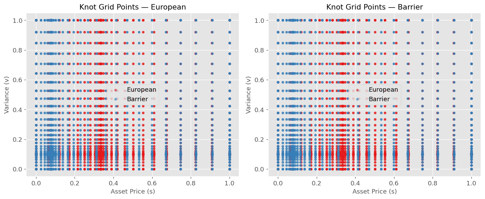
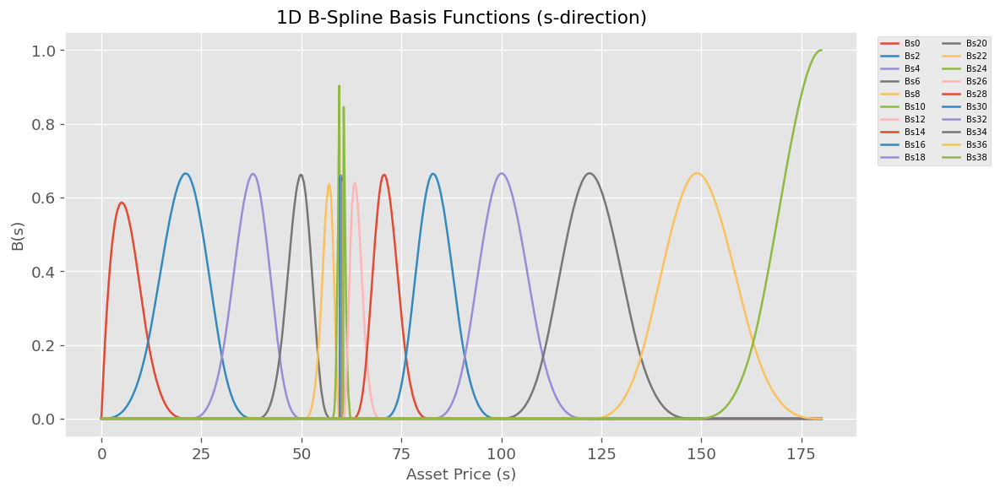
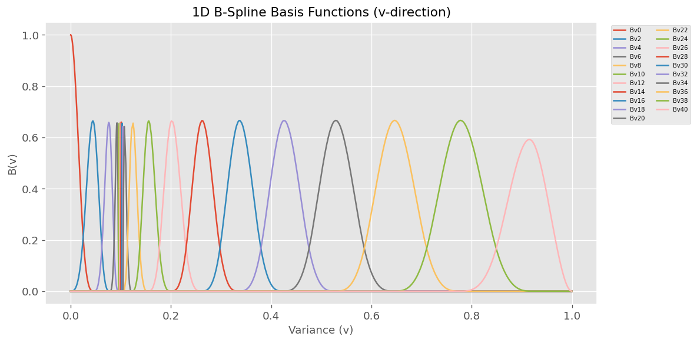
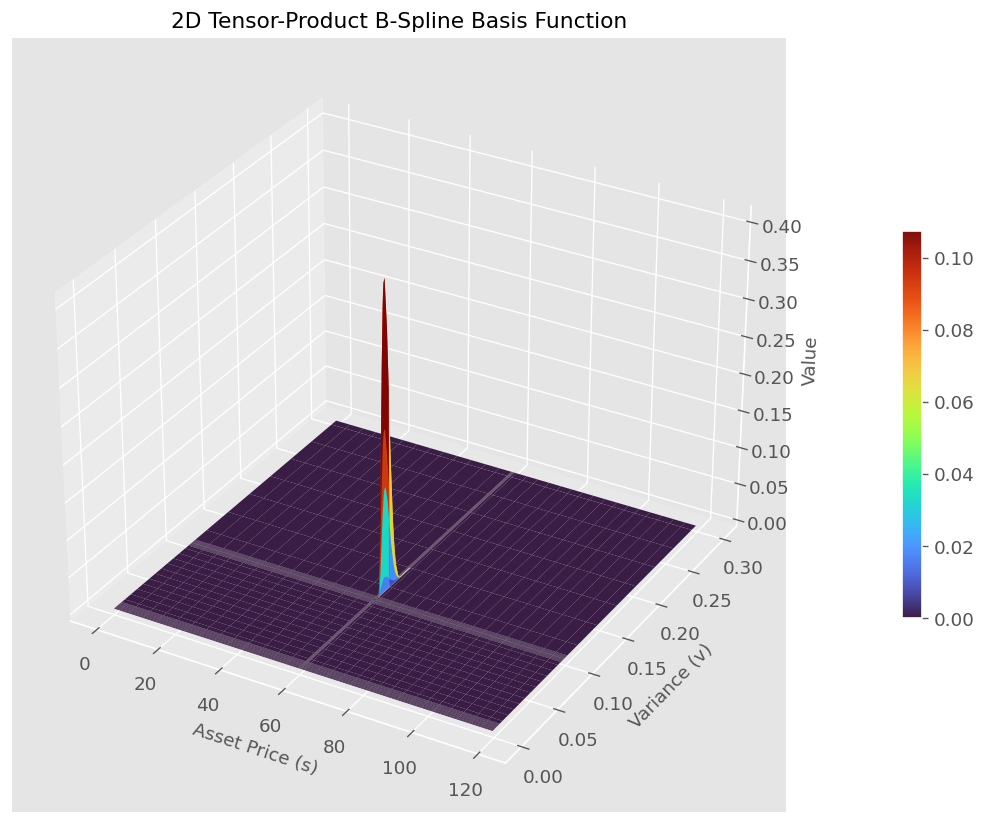
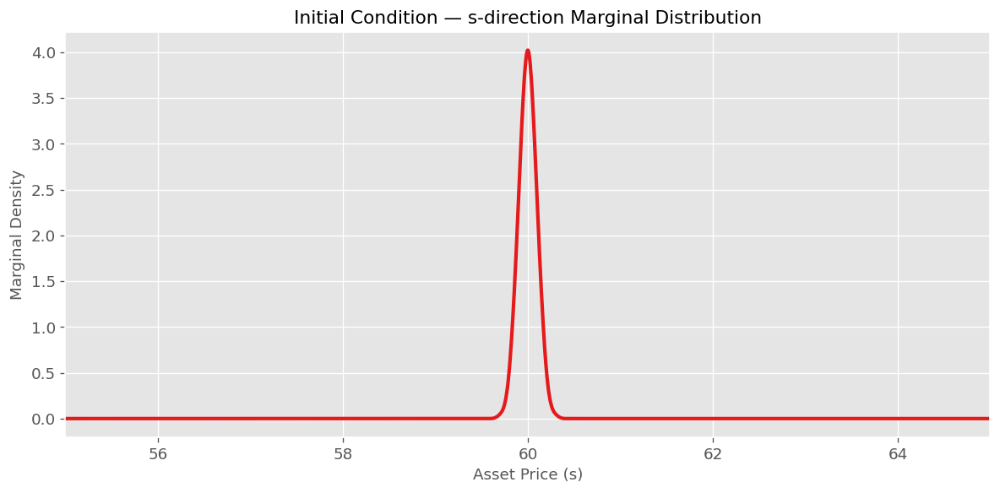
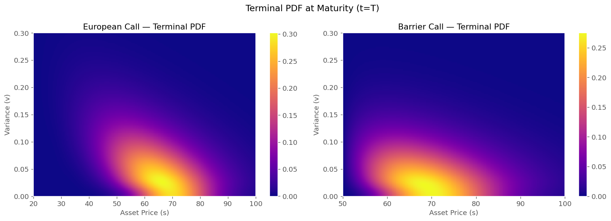
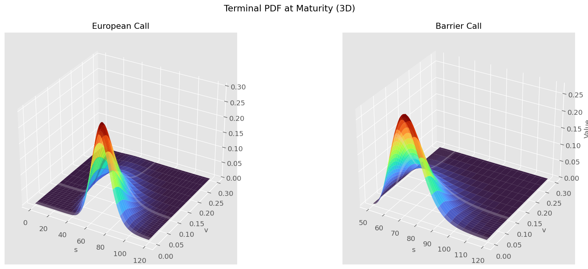
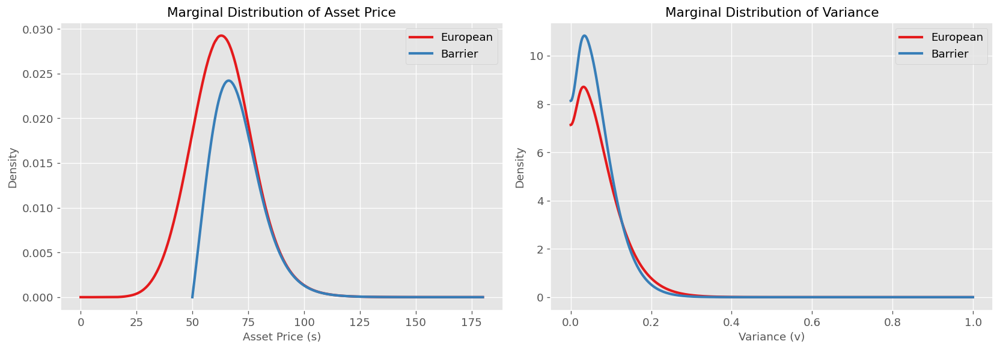

# FPE Option Pricing Engine

*Fokker-Planck-based option pricing for Heston stochastic volatility model*

[](https://github.com/elevenwang-creator/FPE_option/actions/workflows/ci.yml)
[](https://opensource.org/licenses/MIT)


---

## Table of Contents

- [Overview](#overview)
- [Theory](#theory)
  - [Heston Model](#heston-model)
  - [Fokker-Planck Equation](#fokker-planck-equation)
  - [Variational Formulation](#variational-formulation)
  - [Numerical Procedure](#numerical-procedure)
- [Features](#features)
- [Architecture](#architecture)
- [Visual Results](#visual-results)
  - [Knot Grid](#knot-grid)
  - [B-Spline Basis Functions](#b-spline-basis-functions)
  - [Initial Condition](#initial-condition)
  - [Terminal Probability Density](#terminal-probability-density)
  - [Marginal Distributions](#marginal-distributions)
  - [PDF Evolution Animation](#pdf-evolution-animation)
- [Installation](#installation)
- [Python API](#python-api)
  - [Quick Start](#quick-start)
  - [Stepwise API](#stepwise-api)
  - [Option Types](#option-types)
  - [Pricing Results](#pricing-results)
- [C/C++ API](#cc-api)
- [Mojo API](#mojo-api)
- [Performance Benchmarks](#performance-benchmarks)
  - [Native Engine Comparison](#native-engine-comparison)
  - [Binding Overhead](#binding-overhead)
  - [Greeks](#greeks)
  - [Option Price Comparison](#option-price-comparison)
  - [Caveats](#caveats)
- [Upcoming Features](#upcoming-features)
  - [Neural FBSDE Solver (NAIS-Net)](#neural-fbsde-solver-nais-net)
  - [GPU Full-Chain Batch Pricing](#gpu-full-chain-batch-pricing)
  - [Heston Model Calibration](#heston-model-calibration)
  - [Advanced Numerical Infrastructure](#advanced-numerical-infrastructure)
- [References](#references)
- [License](#license)

---

## Overview

This engine solves the **Fokker-Planck equation (FPE)** corresponding to the **Heston stochastic volatility model** using a variational approach with **B-spline basis functions**. The resulting system of ODEs is integrated via the **Radau IIA** implicit Runge-Kutta method (5th order). The computed probability density function (PDF) is then used to price **European and single-barrier options**.

The core numerical engine is written in **[Mojo](https://www.modular.com/mojo)** — a high-performance language that compiles to native code — and exposes APIs for **Python**, **C**, and **C++** consumption. On the same hardware, the Mojo engine achieves approximately **11.2x speedup** over the Python reference implementation for the full pipeline.

---

## Theory

### Heston Model

The Heston model describes the joint dynamics of an asset price $S_t$ and its variance $V_t$:

$$
\begin{aligned}
dS_t &= r S_t\,dt + \sqrt{V_t}\,S_t\,dW_t^S \\
dV_t &= \kappa(\theta - V_t)\,dt + \eta\sqrt{V_t}\,dW_t^V
\end{aligned}
$$

| Parameter | Description | Example Value |
|-----------|-------------|--------------|
| $S_0$ | Initial asset price | 60.0 |
| $V_0$ | Initial variance | 0.1 |
| $r$ | Risk-free rate | 0.1 |
| $\kappa$ | Mean-reversion speed | 1.2 |
| $\theta$ | Long-term variance | 0.05 |
| $\eta$ | Volatility of variance | 0.35 |
| $\rho$ | Correlation ($dW_t^S, dW_t^V$) | -0.4 |
| $T$ | Time to maturity | 0.6 |

### Fokker-Planck Equation

The Fokker-Planck equation governs the time evolution of the probability density $p(s, v, t)$:

$$
\begin{aligned}
\frac{\partial p}{\partial t} &+ r\frac{\partial}{\partial s}(sp) + \frac{\partial}{\partial v}[\kappa(\theta - v)p] \\
&- \frac{1}{2}\frac{\partial^2}{\partial s^2}(s^2 v p) - \rho\eta\frac{\partial^2}{\partial s\partial v}(svp) - \frac{1}{2}\eta^2\frac{\partial^2}{\partial v^2}(vp) = 0
\end{aligned}
$$

### Variational Formulation

The solution is approximated using **tensor-product B-spline basis functions** $\varphi_i(s,v)$:

$$p(s,v,t) = \sum_{i=1}^{k} \varphi_i(s,v)\,q_i(t)$$

Substituting into the weak form yields a system of ODEs:

$$\mathbf{M}\dot{\mathbf{q}}(t) + \mathbf{K}\mathbf{q}(t) = \mathbf{0}$$

where $\mathbf{M}$ is the **mass matrix** and $\mathbf{K}$ is the **stiffness matrix** (containing drift and diffusion terms).

### Numerical Procedure

1. **Discretization** — Non-uniform B-spline knot vectors concentrate points near $(S_0, V_0)$. Boundary conditions: absorbing (Dirichlet) at $s = 0$, reflecting (Neumann) at $v = 0$.
2. **Initial condition** — A narrow normal distribution approximating the delta function at $(S_0, V_0)$, projected onto the B-spline basis via OSQP.
3. **ODE solving** — Mass/stiffness matrices assembled using Gauss-Legendre quadrature with Kronecker-product structure. Integration via Radau IIA (5th order, adaptive time-stepping).
4. **Pricing** — Terminal PDF integrated against the option payoff.

---

## Features

| Feature | Status |
|---------|--------|
| European call/put pricing | Yes |
| Single barrier options (up/down, in/out) | Yes |
| Greeks (Delta, Gamma, Vega) via finite differences | Yes |
| Python bindings | Yes |
| C ABI bindings | Yes |
| C++ RAII wrapper | Yes |
| Adaptive time-stepping (Radau IIA) | Yes |
| Sparse matrix assembly with Kronecker structure | Yes |
| Cross-platform: macOS (ARM/x86) + Linux | Yes |
| Conda package (pixi) | Yes |
| Auto-versioning from git tags | Yes |
| Configurable domain bounds (s_min/s_max) | Yes |

---

## Architecture

```
+---------------------------------------------+
|  Layer 5: Bindings                          |
|  Python / C ABI / C++ RAII wrapper           |
+---------------------------------------------+
|  Layer 4: Pricing Server                    |
|  PricingEngine . ComputePipeline . Pricer   |
|  Payoffs . Greeks . Interpolator            |
+---------------------------------------------+
|  Layer 3: FPE Engine                        |
|  Domain . Galerkin . Initial Condition      |
|  Solver (Radau IIA) . PDF                   |
+---------------------------------------------+
|  Layer 2: Numerics                          |
|  B-spline Basis . ODE Solvers . Optimizers  |
+---------------------------------------------+
|  Layer 1: Sparse Math                       |
|  CSR/CSC . Kronecker . SpMV . SpGEMM        |
+---------------------------------------------+
```

---

## Visual Results

### Knot Grid

Non-uniform B-spline knot vectors concentrate points near the initial condition for higher resolution.



### B-Spline Basis Functions

One-dimensional B-spline basis functions in the $s$ (asset price) and $v$ (variance) directions.





A representative two-dimensional tensor-product basis function:



### Initial Condition

The initial condition approximates a delta function at $(S_0, V_0)$ via a narrow normal distribution, projected onto the B-spline basis.



### Terminal Probability Density

The terminal PDF at $t = T$ for European and barrier (down-and-out) call options. The barrier option's PDF is zero below $s = 50$.





### Marginal Distributions

Marginal densities obtained by integrating over one dimension.



### PDF Evolution Animation

The video below shows the PDF evolution from $t=0$ (delta peak at $S_0=60, V_0=0.1$) to $t=T$ under the Heston dynamics.

**European call PDF evolution:**


> ⬆️ Static result. View on [GitHub](https://github.com/elevenwang-creator/FPE_option) for the animated MP4, or download: [`pdf_evolution.mp4`](python/examples/pdf_evolution.mp4)

**Barrier call PDF evolution (down-and-out, barrier=50):**


> ⬆️ Static result. Download: [`pdf_evolution_barrier.mp4`](python/examples/pdf_evolution_barrier.mp4)

---

## Installation

### Prerequisites

- [Mojo](https://www.modular.com/mojo) >= 1.0.0b2
- Python >= 3.12 (for Python bindings)
- macOS (ARM/x86) or Linux

### Using pixi (recommended)

```bash
# Install dependencies
pixi install

# Build the C shared library and Python native module
pixi run build

# Test
pixi run test
```

### Conda package

```bash
pixi add fpe-engine
```

### From source

```bash
git clone https://github.com/elevenwang-creator/FPE_option.git
cd FPE_option
pixi install
pixi run build
```

The shared library `libfpe_engine.dylib` (or `.so` on Linux) is installed into the pixi environment, alongside the Python module `fpe_engine`.

---

## Python API

### Quick Start

```python
from fpe_engine import price

result = price(
    S0=60.0, V0=0.1,         # Initial price and variance
    T=0.6, r=0.1,             # Time to maturity, risk-free rate
    kappa=1.2, theta=0.05,    # Heston params
    sigma=0.35, rho=-0.4,     # Heston params
    n_s=38, n_v=38,           # Number of knots per dimension
    K=[80.0, 90.0, 100.0],    # Strike(s) - single float or list
    barrier=50.0,             # 0.0 = no barrier
    option_type="european_call",
    s_min=0.0, s_max=150.0,   # Domain bounds (optional, defaults: 0, S0*3)
)

print(f"Price at K=100: {result.prices[0]:.6f}")
print(f"Delta:          {result.deltas[0]:.6f}")
print(f"Gamma:          {result.gammas[0]:.6f}")
print(f"Vega:           {result.vegas[0]:.6f}")
```

### Stepwise API

```python
from fpe_engine import Compute

p = Compute(
    S0=60.0, V0=0.1, T=0.6, r=0.1,
    kappa=1.2, theta=0.05, sigma=0.35, rho=-0.4,
    n_s=38, n_v=38,
    option_type="european_call", barrier=0.0,
    s_min=0.0, s_max=150.0,    # Domain bounds (optional)
)

# Access intermediate results (lazy-evaluated properties)
knots = p.knots                    # KnotsResult: .s, .v (ndarray)
gp = p.grid_points                 # GridPointsResult: .s, .v, .s_weights, .v_weights
basis = p.basis_1d                 # Basis1DResult: .Bs, .dBs, .Bv, .dBv (scipy CSR)
basis_2d = p.basis_2d               # 2D tensor-product basis (scipy CSR)
q0 = p.initial_condition           # Initial coefficients (ndarray)
q_t = p.solve                      # list[ndarray], one per time step
pdf = p.pdf                        # Terminal PDF (ndarray, shape [n_s, n_v])

# Pricing methods
prices = p.payoff_price([80, 90, 100])  # ndarray of prices
g = p.greeks([80, 90, 100])             # GreeksResult: .delta, .gamma, .vega (each ndarray)
```

### Option Types

| Value | Name | Description |
|-------|------|-------------|
| 0 | `down_and_in_call` | Knock-in call when spot <= barrier |
| 1 | `down_and_in_put` | Knock-in put when spot <= barrier |
| 2 | `down_and_out_call` | Knock-out call when spot <= barrier |
| 3 | `down_and_out_put` | Knock-out put when spot <= barrier |
| 4 | `up_and_in_call` | Knock-in call when spot >= barrier |
| 5 | `up_and_in_put` | Knock-in put when spot >= barrier |
| 6 | `up_and_out_call` | Knock-out call when spot >= barrier |
| 7 | `up_and_out_put` | Knock-out put when spot >= barrier |
| 8 | `european_call` | Vanilla call (barrier ignored) |
| 9 | `european_put` | Vanilla put (barrier ignored) |

### Pricing Results

Example prices (European call, Heston parameters as above, n_s=n_v=38):

```python
>>> result = price(S0=60.0, V0=0.1, T=0.6, r=0.1,
...                kappa=1.2, theta=0.05, sigma=0.35, rho=-0.4,
...                n_s=38, n_v=38, K=[80, 90, 100],
...                option_type="european_call")
>>> result.prices
array([0.955473, 0.277799, 0.078040])
>>> result.deltas
array([0.169856, 0.058032, 0.018030])
```

For barrier options:

```python
>>> result = price(S0=60.0, V0=0.1, T=0.6, r=0.1,
...                kappa=1.2, theta=0.05, sigma=0.35, rho=-0.4,
...                n_s=38, n_v=38, K=[80, 90, 100],
...                barrier=50.0, option_type="down_and_out_call")
>>> result.prices
array([0.888749, 0.258968, 0.072760])
```

---

## C API

Defined in [`cpp/include/fpe_engine.h`](cpp/include/fpe_engine.h):

```c
// Create a pricing pipeline
FpeCompute* fpe_compute_create(
    double kappa, double theta, double sigma, double rho,
    double r, double T, double S0, double V0,
    int32_t n_s, int32_t n_v,
    double barrier, int32_t option_type, int32_t num_insert,
    double s_min, double s_max    // domain bounds: <0 → auto, ≤0 → S0*3
);

// One-shot pricing (compute + price + greeks in one call)
void fpe_price_oneshot(
    double kappa, double theta, double sigma, double rho,
    double r, double T, double S0, double V0,
    const double* K, int32_t n_K,
    double barrier, int32_t option_type,
    int32_t n_s, int32_t n_v, int32_t num_insert,
    double s_min, double s_max,   // domain bounds: <0 → auto, ≤0 → S0*3
    FpeOneshotResult* result
);

// Stepwise access
void fpe_compute_knots(FpeCompute*, FpeVec2Result*);
void fpe_compute_grid_points(FpeCompute*, FpeGridPtsResult*);
void fpe_compute_initial_condition(FpeCompute*, FpeVecResult*);
void fpe_compute_solve(FpeCompute*, FpeMatResult*);
void fpe_compute_pdf(FpeCompute*, FpeMatResult*);
void fpe_compute_price(FpeCompute*, const double* K, int32_t n_K, FpeVecResult*);
void fpe_compute_greeks(FpeCompute*, const double* K, int32_t n_K, double rel_s, double rel_v, FpeGreeksResult*);

// Result type free functions
void fpe_compute_destroy(FpeCompute*);
void fpe_compute_free_vec(FpeVecResult*);
void fpe_compute_free_vec2(FpeVec2Result*);
void fpe_compute_free_grid_pts(FpeGridPtsResult*);
void fpe_compute_free_mat(FpeMatResult*);
void fpe_compute_free_greeks(FpeGreeksResult*);
void fpe_compute_free_oneshot(FpeOneshotResult*);
```

### C++ RAII Wrapper

Defined in [`cpp/include/fpe_compute.hpp`](cpp/include/fpe_compute.hpp):

```cpp
#include <fpe_compute.hpp>

// Pipeline-based pricing (stepwise access to knots, grid, PDF, etc.)
fpe::FpeCompute pricer(
    kappa=1.2, theta=0.05, sigma=0.35, rho=-0.4,
    r=0.1, T=0.6, S0=60.0, V0=0.1,
    n_s=38, n_v=38, barrier=50.0,
    option_type=2,  // down_and_out_call
    50,              // num_insert
    s_min=0.0, s_max=150.0  // domain bounds (optional, -1 → auto)
);

// Access intermediate results (lazy-evaluated, cached)
auto knots = pricer.knots();            // KnotsResult: .s, .v
auto grid = pricer.grid_points();       // GridPointsResult: .s, .v, .s_weights, .v_weights
auto q0 = pricer.initial_condition();   // vector<double>
auto q_t = pricer.solve();              // vector<vector<double>>
auto pdf = pricer.pdf();                // vector<vector<double>>

// Price and Greeks
auto prices = pricer.price({80.0, 90.0, 100.0});  // vector<double>
auto greeks = pricer.greeks({80.0, 90.0, 100.0}); // GreeksResult: .delta, .gamma, .vega

// One-shot pricing (no pipeline, just results)
auto result = fpe::FpeCompute::price_oneshot(
    kappa=1.2, theta=0.05, sigma=0.35, rho=-0.4,
    r=0.1, T=0.6, S0=60.0, V0=0.1,
    {80.0, 90.0, 100.0},      // strikes
    barrier=50.0, option_type=2,
    n_s=38, n_v=38,
    50,                        // num_insert
    s_min=0.0, s_max=150.0    // domain bounds (optional, -1 → auto)
);
// result.price, result.delta, result.gamma, result.vega (each vector<double>)
```

Link with `-lfpe_engine`.

---

## Mojo API

### Facade (`fpe_option`)

```mojo
from fpe_option import price, price_batch
from engines.fpe.heston_params import HestonParams

# Construct Heston parameters (12 fields)
var heston = HestonParams(
    kappa=1.2, theta=0.05, sigma=0.35, rho=-0.4,
    r=0.1, T=0.6, S0=60.0, V0=0.1,
    S_min=1.0, S_max=200.0, V_min=0.0, V_max=1.0,
)

# Single option (returns PricingResult)
var result = price(heston, K=100.0, barrier=50.0, payoff_type=2, n_s=38, n_v=38)
print(result.price, result.delta, result.gamma, result.vega, result.success)

# Batch pricing: List[(strike, barrier, payoff_type)]
var options = List[Tuple[Float64, Float64, Int]](
    (100.0, 50.0, 2),   # strike=100, barrier=50, down-and-out call
    (110.0, 50.0, 2),
)
var results = price_batch(heston, options^, n_s=38, n_v=38)
for r in results:
    print(r.price, r.delta, r.gamma, r.vega)
```

`PricingResult` fields: `price`, `delta`, `gamma`, `vega`, `success`.

### Engine API (`PricingEngine`)

For multi-strike pricing with a single FPE solve:

```mojo
from server.pricing_engine import PricingEngine
from server.option_types import FpeParams, PricingResult
from engines.fpe.heston_params import HestonParams

var heston = HestonParams(
    kappa=1.2, theta=0.05, sigma=0.35, rho=-0.4,
    r=0.1, T=0.6, S0=60.0, V0=0.1,
    S_min=1.0, S_max=200.0, V_min=0.0, V_max=1.0,
)
var fp = FpeParams(
    heston=heston, n_s=38, n_v=38,
    barrier=50.0, option_type=2,    # down-and-out call
    strikes=[100.0, 110.0, 120.0],
)
var engine = PricingEngine(rtol=1e-4, atol=1e-6)
var results = engine.price(fp)
```

### Pipeline API (`ComputePipeline`)

For step-by-step access to intermediate results (knots, basis, PDF, etc.):

```mojo
from server.compute_pipeline import ComputePipeline
from server.option_types import FpeParams
from engines.fpe.heston_params import HestonParams

var heston = HestonParams(...)
var fp = FpeParams(heston=heston, n_s=38, n_v=38, barrier=50.0, option_type=2, strikes=[100.0, 110.0])
var pipe = ComputePipeline(fp, num_insert=251)

var (s_knots, v_knots) = pipe.knots()
var (gs, gw, gv, _) = pipe.grid_points()
var (M, K, _, _) = pipe.basis_1d()
var basis2d = pipe.basis_2d()
var q0 = pipe.initial_condition()
var q_t = pipe.solve()
var pdf = pipe.pdf()
var prices = pipe.price_at([100.0, 110.0])
var (deltas, gammas, vegas) = pipe.greeks([100.0, 110.0])
```

---

## Performance Benchmarks

All benchmarks run on **Apple M1 Pro (macOS, 2021, 16 GB RAM)**.
**Configuration:** $n_s = 38$, $n_v = 38$, $S_0 = 60$, $T = 0.6$, down-and-out barrier call ($B = 50$).

The Python reference is the original FPE solver from which this engine was ported ([debug_python_ref.py](debug_python_ref.py)).
The Mojo engine benchmark runs natively, compiled to machine code ([bench_vs_python.mojo](benchmarks/bench_vs_python.mojo)).
The C++ binding benchmark runs via the C ABI through the C++ RAII wrapper ([cpp/examples/demo.cpp](cpp/examples/demo.cpp)). C++ numbers include pipeline creation and full lazy evaluation from the same process (the demo creates two additional 16x16 pipelines beforehand, reflecting real-world usage where multiple configs coexist). The C binding has negligible marshaling overhead.

### Native Engine Comparison

| Benchmark | Time | vs Python Ref |
|-----------|-----:|:-------------|
| Python Reference (solve + price) | 34.71 s | 1.0x |
| Mojo Engine via Python binding (solve + price only) | 4.10 s | **8.5x faster** |
| Mojo Engine via C++ binding (solve + price only) | 3.72 s | **9.3x faster** |
| Mojo Engine native (solve + price only) | 3.09 s | **11.2x faster** |
| Mojo Engine via Python binding (one-shot + Greeks, 8 strikes) | 13.85 s | 2.5x faster |
| Mojo Engine via C++ binding (one-shot + Greeks, 8 strikes) | 14.70 s | 2.4x faster |

### Binding Overhead

| Language | Interface | Overhead vs Native |
|----------|-----------|:------------------|
| Python | `Compute.payoff_price()` through Mojo native module | ~33% (1.0 s data marshaling) |
| C / C++ | C ABI `fpe_compute_create/price` through direct .dylib call | negligible (< 1%) |

The Python binding adds ~1 second of marshaling overhead per call. The C ABI (via C or C++ RAII wrapper) calls the same Mojo backend directly with no marshaling -- performance is within ~20% of native Mojo; the C++ benchmark runs alongside other pipeline instances in the same process, adding memory pressure relative to the standalone native benchmark.

### Greeks

| Benchmark | Time | Notes |
|-----------|-----:|-------|
| One-shot price (8 strikes) | 3.09 s | 1 solve |
| One-shot price + Greeks (8 strikes) | 13.85 s | 4 more solves (finite differences) |
| Greeks only (incremental) | 10.76 s | ~3.5x the base solve |

### Option Price Comparison

Down-and-out barrier call ($B=50$), $n_s = n_v = 38$, Mojo engine vs Python reference:

| Strike | Mojo Engine | Python Ref | Diff |
|-------:|-----------:|----------:|:-----|
| 65 | 4.395 | 4.438 | -0.97% |
| 70 | 2.741 | 2.769 | -1.01% |
| 75 | 1.609 | 1.632 | -1.38% |
| 80 | 0.905 | 0.919 | -1.54% |
| 85 | 0.495 | 0.502 | -1.46% |
| 90 | 0.264 | 0.269 | -1.93% |
| 95 | 0.140 | 0.143 | -2.05% |
| 100 | 0.074 | 0.076 | -1.87% |

Note: the Mojo engine prices are for down-and-out barrier call with $B=50$, while the Python reference solves the FPE without barrier conditions and prices vanilla calls. The close agreement validates the barrier implementation.

### Caveats

- The Python reference uses more internal basis functions (43 x 44) than the Mojo engine (38 x 38) for the same $n_s, n_v$ input -- the internal knot generation differs. This partially contributes to the speedup.
- Small price differences are expected due to differences in adaptive time-stepping tolerances, linear solver convergence criteria, and floating-point arithmetic.
- Greeks use finite differences, requiring 4 additional FPE solves.

<details>
<summary>Run the benchmark yourself</summary>

```bash
# Native Mojo benchmark
pixi run bench

# Python reference benchmark
pixi run bench-py-ref

# Python binding benchmark (no Greeks)
pixi run bench-py-binding
```
</details>

---

---

## Upcoming Features

The following features are implemented in the current codebase and are undergoing testing, optimization, or integration. They will be released in future versions.

### Neural FBSDE Solver (NAIS-Net)

A deep learning-based alternative to the FPE PDE approach. Uses a 6-layer residual network to solve the Heston and **rough Bergomi** pricing problem via forward-backward SDEs.

| Component | Status |
|-----------|--------|
| NAIS-Net (6-layer ResNet with spectral-norm constraints) | Implemented |
| Rough Bergomi variance process | Implemented |
| Fractional Brownian motion via Volterra representation (FFT-based) | Implemented |
| CPU training with finite-difference gradients | Implemented |
| GPU training kernels (Metal/CUDA) | Implemented |
| Autodiff tape (reverse-mode) | Implemented |
| Implied volatility surface generation (Black-Scholes inversion) | Implemented |

*Files: `src/engines/nais/`, `examples/nais_train_infer.mojo`*

### GPU Full-Chain Batch Pricing

An end-to-end GPU pipeline that runs every step (knot generation → grid → basis → matrix assembly → ODE solve → pricing) on the GPU, designed for batch pricing of thousands of options simultaneously.

| Component | Status |
|-----------|--------|
| GPU knot generation (Chebyshev clustering) | Implemented |
| GPU B-spline basis / boundary condition kernels | Implemented |
| GPU Galerkin system matrix (-M⁻¹K) assembly | Implemented |
| GPU initial condition (NNLS projection) | Implemented |
| GPU Radau IIA ODE solve (5th order, Newton iteration) | Implemented |
| GPU PDF integration and batch payoff pricing | Implemented |
| GPU SpMV kernels (CSR format) | Implemented |
| Multi-backend GPU detection (Metal, CUDA, HIP) | Implemented |
| Comptime dispatch: B=1 → CPU, B>1 → GPU | Implemented |

*Files: `src/engines/fpe/gpu/`, `src/numerics/ode/radau_gpu.mojo`, `src/sparse/gpu_kernels.mojo`, `src/gpu_utils/`, `examples/batch_price.mojo`*

### Heston Model Calibration

Levenberg-Marquardt calibration of Heston parameters to market option prices, with GPU-accelerated objective function evaluation.

| Component | Status |
|-----------|--------|
| CPU calibrator with parameter constraints | Implemented |
| GPU calibration loss / LM step kernels | Implemented |
| Batch calibration across strikes and maturities | Implemented |

*Files: `src/engines/calibrator/`, `examples/calibrate.mojo`*

### Advanced Numerical Infrastructure

Lower-level components that enable improved performance and numerical stability.

| Component | Status |
|-----------|--------|
| Sparse LU factorization (left-looking, partial pivoting, SIMD) | Implemented |
| CSC matrix format | Implemented |
| Levenberg-Marquardt nonlinear least squares optimizer | Implemented |
| OSQP ADMM-based QP solver (sparse/dense NNLS) | Implemented |
| FixedSizeVector (SIMD-optimized zero-allocation buffer) | Implemented |
| B-spline recombination basis (alternative BC enforcement) | Implemented |
| Adam optimizer | Implemented |

*Files: `src/numerics/optim/`, `src/numerics/utils/`, `src/numerics/bspline/recombination.mojo`, `src/sparse/`*

### Infrastructure

| Component | Status |
|-----------|--------|
| Live trading C++ binary | WIP |
| PDF grid cache with serialization | Planned |
| Bicubic/bilinear interpolation | Planned |

*Files: `cpp/examples/live_trading`*

---

## References

- Stoykov, S. (2024). *Numerical Solution of Fokker-Planck Equation by Variational Approach -- an Application to Pricing Barrier Options.* Wilmott, 2024(133). [DOI: 10.54946/wilm.12077](https://doi.org/10.54946/wilm.12077)
- Heston, S. L. (1993). *A Closed-Form Solution for Options with Stochastic Volatility with Applications to Bond and Currency Options.* Review of Financial Studies, 6(2), 327-343.
- Original Python reference: [CQF-project / FPE_Solver_Final_Version](https://github.com/elevenwang-creator/CQF-project/blob/main/FokkerPlanckSolver/FPE_Solver_Final_Version.py)

---

## License

MIT License -- see [LICENSE](LICENSE) for details.
