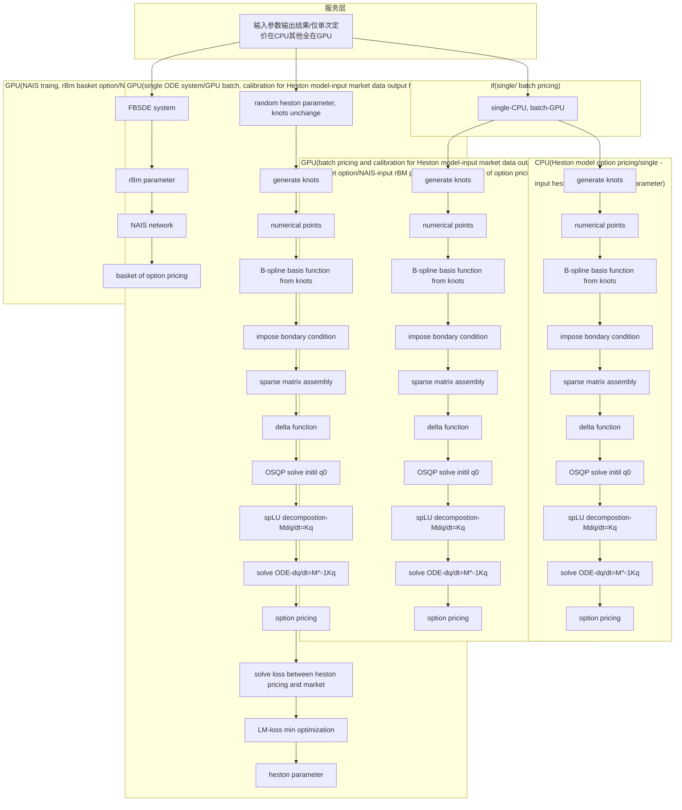

```mermaid
graph TD
    subgraph "服务层"
        Central[输入参数输出结果/仅单次定价在CPU其他全在GPU]
    end

    subgraph "if(single/ batch pricing)"
        if[single-CPU, batch-GPU]
    end
    subgraph "CPU(Heston model option pricing/single - 
        <br/>input heston, knots,option type parameter)"
        knots[generate knots]
        grid[numerical points]
        basis[B-spline basis function from knots]
        boundary[impose bondary condition]
        SPmatrix[sparse matrix assembly]
        delta[delta function]
        inital[OSQP solve initil q0]
        LU[spLU decompostion-Mdq/dt=Kq]
        RADAU5[solve ODE-dq/dt=M^-1Kq]
        integrate[option pricing]
    end

    subgraph "GPU(batch pricing and calibration for Heston model-input market data output heston parameter,
        rBm basket option/NAIS-input rBM parameter output basket of option pricing)"
        knots_GPU[generate knots]
        grid_GPU[numerical points]
        basis_GPU[B-spline basis function from knots]
        boundary_GPU[impose bondary condition]
        SPmatrix_GPU[sparse matrix assembly]
        delta_GPU[delta function]
        inital_GPU[OSQP solve initil q0]
        LU_GPU[spLU decompostion-Mdq/dt=Kq]
        RADAU5_GPU[solve ODE-dq/dt=M^-1Kq]
        integrate_GPU[option pricing]
    end

    subgraph "GPU(single ODE system/GPU batch, calibration for Heston model-input market data output heston parameter)"
        parameter[random heston parameter, knots unchange]
        knots_Cal[generate knots]
        grid_Cal[numerical points]
        basis_Cal[B-spline basis function from knots]
        boundary_Cal[impose bondary condition]
        SPmatrix_Cal[sparse matrix assembly]
        delta_Cal[delta function]
        inital_Cal[OSQP solve initil q0]
        LU_Cal[spLU decompostion-Mdq/dt=Kq]
        RADAU5_Cal[solve ODE-dq/dt=M^-1Kq]
        integrate_Cal[option pricing]
        loss[solve loss between heston pricing and market]
        LM[LM-loss min optimization]
        out[heston parameter]
    end

    subgraph "GPU(NAIS traing, rBm basket option/NAIS-input rBM parameter output basket of option pricing)"
        FBSDE[FBSDE system]
        rBm[rBm parameter]
        NAIS[NAIS network]
        price[basket of option pricing]
    end

    Central --> if & parameter & FBSDE
    
    if --> knots --> grid --> basis --> boundary --> SPmatrix --> delta--> inital--> LU --> RADAU5 --> integrate
    
    if --> knots_GPU --> grid_GPU--> basis_GPU--> boundary_GPU --> SPmatrix_GPU --> delta_GPU --> inital_GPU --> LU_GPU --> RADAU5_GPU --> integrate_GPU
    
    parameter --> knots_Cal --> grid_Cal--> basis_Cal--> boundary_Cal --> SPmatrix_Cal --> delta_Cal --> inital_Cal--> LU_Cal --> RADAU5_Cal--> integrate_Cal --> loss --> LM --> out
    
    FBSDE --> rBm --> NAIS --> price
```    
